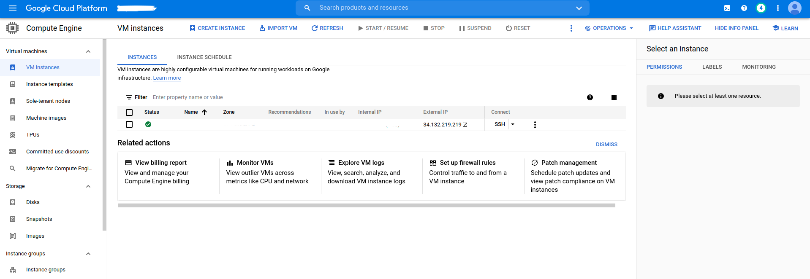
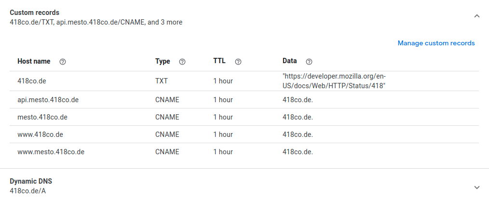

# Mesto - full stack hosted MERN photo sharing web app

Front end:
- [github](https://github.com/418code/react-mesto-auth/tree/final-jwt-local)
- [http://mesto.418co.de](http://mesto.418co.de)

Back end:
- [github](https://github.com/418code/express-mesto)
- [https://api.mesto.418co.de](https://api.mesto.418co.de)

In addition to technologies described in corresponding github repositories,
combined project uses a custom domain, GCP debian VM with Nginx, PM2 with auto reload script and Let's Encrypt SSL certificate.

